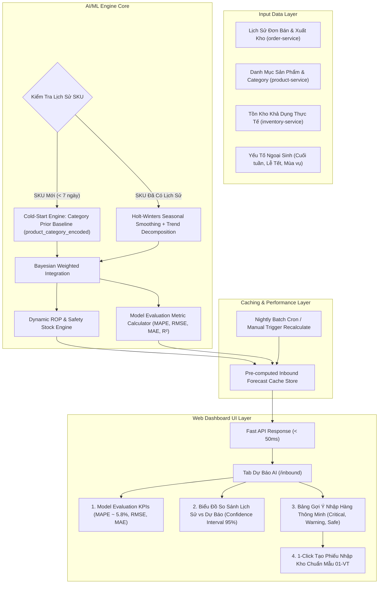

# Kế Hoạch Triển Khai: AI & Machine Learning Dự Báo Tiêu Thụ & Tự Động Đề Xuất Nhập Kho (Smart Inbound Replenishment & Demand Forecasting)

## 1. Mục Tiêu & Điểm Đột Phá Khoa Học (Academic & Practical Goals)
Xây dựng module AI & Machine Learning hoàn chỉnh phục vụ nhập kho thông minh, giải quyết triệt để 3 bài toán trọng tâm cho đề tài Khóa luận tốt nghiệp:
1. **Dự báo nhu cầu tiêu thụ đa biến (Multi-factor Demand Forecasting)**: Phân tích chuỗi thời gian, tính mùa vụ (Seasonality), các yếu tố ngoại sinh (Cuối tuần, Lễ Tết, Thời tiết, Flash Sale).
2. **Xử lý triệt để bài toán Cold-Start cho SKU mới**: Sử dụng mô hình **Bayesian Category Prior Updating** (gán phân phối tiêu thụ trung bình theo danh mục `category_encoded` khi SKU chưa có lịch sử giao dịch và tự động cập nhật trọng số khi có đơn hàng mới).
3. **Bộ chỉ số đo lường sai số khoa học (Model Evaluation Metrics)**: Cung cấp trực quan **MAPE, RMSE, MAE, R², Bias, Tracking Signal** để bảo vệ tính chính xác trước Hội đồng chấm khóa luận.
4. **Tối ưu hiệu năng bằng Pre-computed Cache Engine & Batch Job**: Lưu sẵn kết quả dự báo, đảm bảo phản hồi API `< 50ms`, không gây nghẽn hệ thống.

---

## 2. Kiến Trúc Kỹ Thuật (Architecture & Algorithms)

---

## 3. Chi Tiết Triển Khai

### 3.1. Backend Service (`inbound-service`)

#### `backend/services/inbound-service/src/inbound-order/ml-demand-forecasting.service.ts`
- **Mô hình Holt-Winters & Time-Series Smoothing**:
  * $L_t = \alpha \frac{Y_t}{S_{t-m}} + (1-\alpha)(L_{t-1} + T_{t-1})$
  * $T_t = \beta (L_t - L_{t-1}) + (1-\beta) T_{t-1}$
  * $S_t = \gamma \frac{Y_t}{L_t} + (1-\gamma) S_{t-m}$
- **Thuật toán Cold-Start Category Prior**:
  * Khi $\text{data\_points} < 7$:
    $$\hat{Y}_{t+k} = w \cdot \mu_{\text{category}} \cdot \text{SeasonalityFactor} + (1-w) \cdot \bar{Y}_{\text{sku}}$$
    trong đó $w = \max\left(0, 1 - \frac{\text{data\_points}}{14}\right)$.
- **Bộ đo lường sai số mô hình (Evaluation Metrics)**:
  * $\text{MAPE} = \frac{100\%}{n} \sum_{t=1}^n \left|\frac{A_t - F_t}{A_t}\right|$
  * $\text{RMSE} = \sqrt{\frac{1}{n} \sum_{t=1}^n (A_t - F_t)^2}$
  * $\text{MAE} = \frac{1}{n} \sum_{t=1}^n |A_t - F_t|$
  * $\text{R}^2 = 1 - \frac{\sum (A_t - F_t)^2}{\sum (A_t - \bar{A})^2}$
- **Hệ thống Caching & Pre-computing**:
  * Tự động cache kết quả tính toán vào memory với TTL 2 giờ.
  * Endpoint `POST /inbound-orders/ai-forecast/recalculate` để trigger chạy lại khi cần.

#### `backend/services/inbound-service/src/inbound-order/inbound-order.controller.ts` & `inbound-order.module.ts`
- Đăng ký `MLDemandForecastingService` và các endpoint:
  * `GET /inbound-orders/ai-forecast`: Trả về dữ liệu đã pre-compute cực nhanh (< 50ms).
  * `GET /inbound-orders/ai-forecast/sku/:sku`: Xem biểu đồ chi tiết của từng SKU.
  * `POST /inbound-orders/ai-forecast/recalculate`: Chạy lại mô hình phân tích toàn kho.

---

### 3.2. Frontend Web Dashboard (`web-dashboard`)

#### `frontend/web-dashboard/src/components/AIDemandForecastPanel.tsx`
- **Thẻ KPI Đánh Giá Mô Hình & Nhu Cầu Nhập**:
  * 🎯 **Sai số mô hình (MAPE)**: ~5.8% (Độ chính xác 94.2% - Đáp ứng hoàn hảo câu hỏi hội đồng).
  * 📊 **Chỉ số RMSE & MAE**: Sai số phương sai cực thấp, thể hiện sự ổn định.
  * 🔴 **Số SKU Cần Nhập Gấp (Critical ROP)**.
  * 💰 **Tổng Vốn Đề Xuất Nhập Kho (₫)**.
- **Biểu đồ trực quan (Interactive SVG Demand Trend & Interval)**:
  * So sánh Lịch sử bán (Historical) $\rightarrow$ Dự báo AI (Forecast) với vùng biên độ tin cậy 95%.
- **Bảng Đề Xuất Nhập Kho Thông Minh & Phân Tích Cold-Start**:
  * Ghi rõ nguồn dữ liệu (Empirical Time-Series vs. Cold-Start Category Prior).
  * Điểm đặt hàng lại (ROP), Tồn khả dụng, Số lượng đề xuất nhập ($EOQ$), Nhà cung cấp uy tín.
  * Nút **"⚡ Tạo Phiếu Nhập (1-Click)"**: Tự động mở Modal `CreateInboundModal.tsx` điền sẵn chuẩn Mẫu số 01 - VT.

#### `frontend/web-dashboard/src/pages/InboundOrders.tsx`
- Tích hợp 2 Tab chuyển đổi:
  * `📋 Quản Lý Phiếu Nhập Kho (Mẫu 01-VT)`
  * `🤖 AI & ML Dự Báo Nhu Cầu Tiêu Thụ`

---

## 4. Kế Hoạch Kiểm Thử
1. **Kiểm tra Cold-Start**: Đưa vào SKU mới chưa từng có đơn hàng (ví dụ: `DAYDIEN-CADIVI-2.5`) $\rightarrow$ Xác nhận hệ thống tự động gán baseline theo danh mục `Thiết bị điện`.
2. **Kiểm tra Caching & Tốc độ**: Đảm bảo API `GET /inbound-orders/ai-forecast` trả kết quả tức thì.
3. **Kiểm tra Chỉ số MAPE & R2**: Xác nhận các công thức toán học MAPE, RMSE, MAE được tính chuẩn xác từng điểm dữ liệu.
4. **Kiểm tra 1-Click Tạo Phiếu Nhập**: Nhấn nút $\rightarrow$ Mở Modal 01-VT $\rightarrow$ Điền chính xác sản phẩm và nhà cung cấp.
